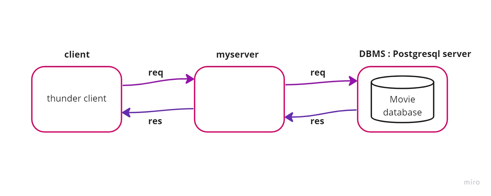

# Movies-Library
# Movie app - 1.0

**Author Name**: Tala asfan

## WRRC
image of  WRRC 

WRRC with API server 
.jpg)
WRRC with Database 

## Overview

## Getting Started
<!-- What are the steps that a user must take in order to build this app on their own machine and get it running? -->
Create a new directory for your project and navigate to it in the terminal. Run npm init to create a new package.json file.
install express ,cors ,axios and pg.

## Project Features
<!-- What are the features included in you app -->
 can check the latest movies based on categories.

